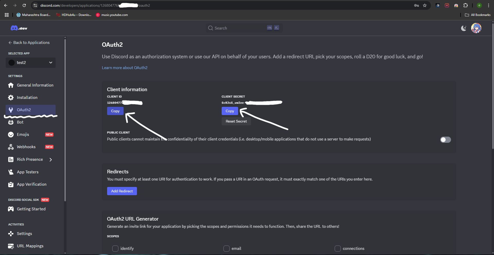

# Discord Login Backend \[TEMPLATE\]
Basic backend template with discord based login implementation which you can use to create discord bot dashboards.
## Installation
1. Create a `.env` file.
2. Copy all the contents of `example.env` to `.env` file.
3. Fill each of them with desired strings.
    ```env
    MONGO_URI=
    SESSION_SECRET=
    PORT=
    DISCORD_CLIENT_ID=
    DISCORD_CLIENT_SECRET=
    DISCORD_CALLBACK_URL=
    ```
    it will look something like this.

- `MONGO_URI` Is your mongodb connection string.
- `SESSION_SECRET` It should be some random string. for example "catKey".
- To obtain your `DISCORD_CLIENT_ID` and `DISCORD_CLIENT_SECRET`, you have to visit https://discord.com/developers/applications

4. Install dependencies by using npm or simply paste this
    ```bash
    npm build
    ```
5. Finally, check if its running by pasting this into your terminal.
    ```bash
    npm run start
    ```
6. Thats it.
